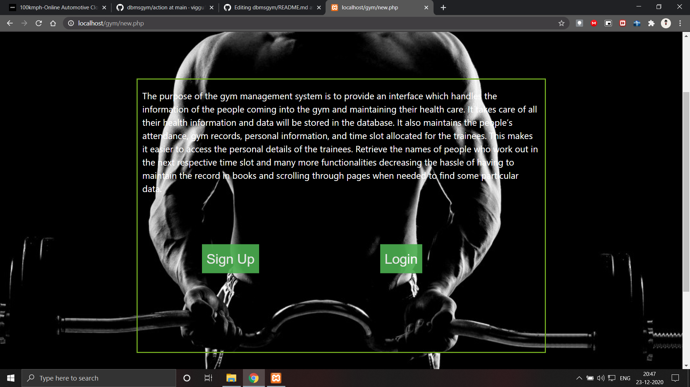
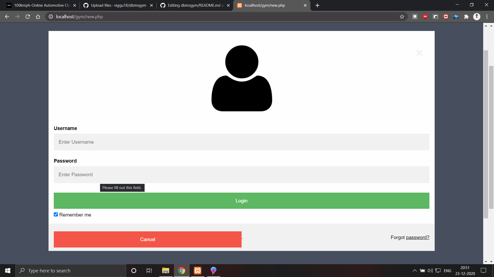
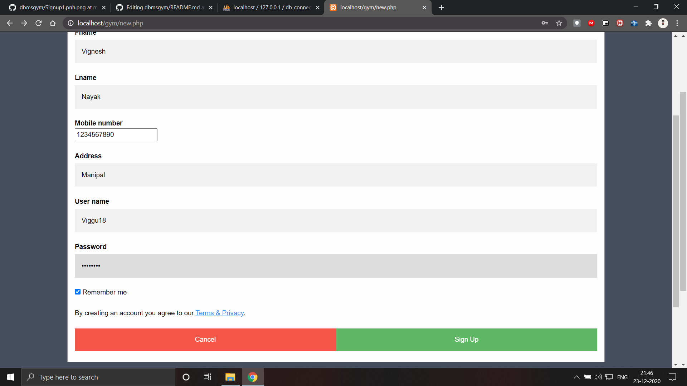
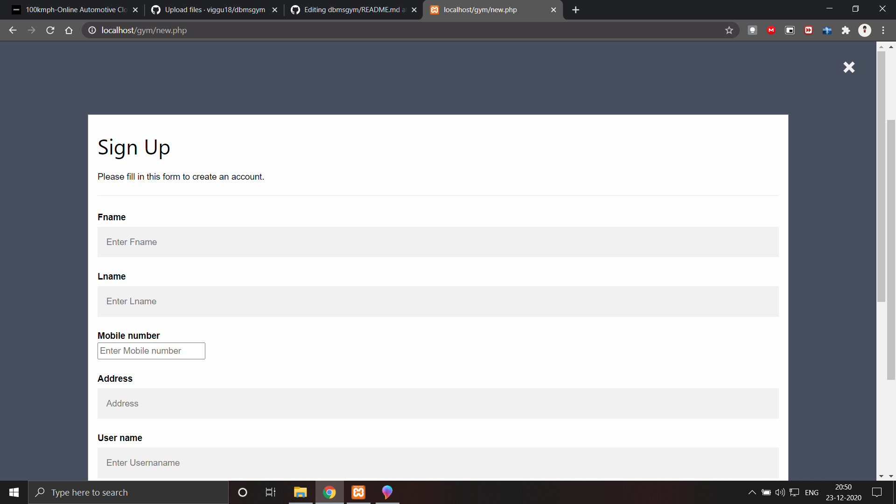
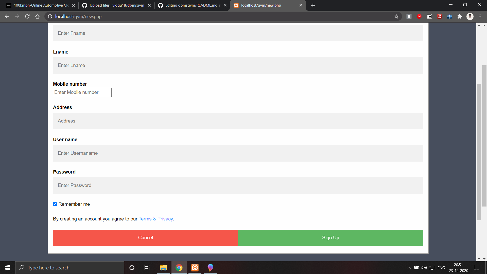
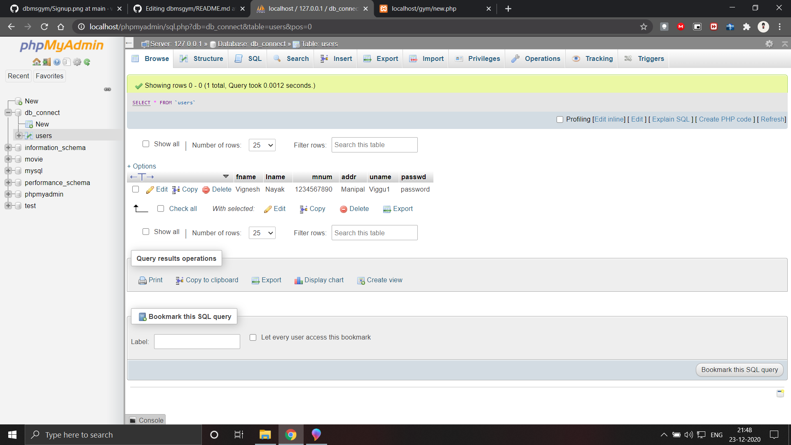

# DBMS mini project
# GymManagementSystem 
AIM: The purpose of the gym management system is to provide an interface which handles the information of the people coming into the gym and maintaining their health care.

New.php
This contains both login and signup page used by admin and the instructors to manage the system.

conn.php 
This includes the code to establish connection to the SQL server and Database used to store data.

login.php
This includes the code to connect to the database and verify the login credentials entered in the site.

sign.php
This includes the code that registers user withthe data entered by the user in the site. 

